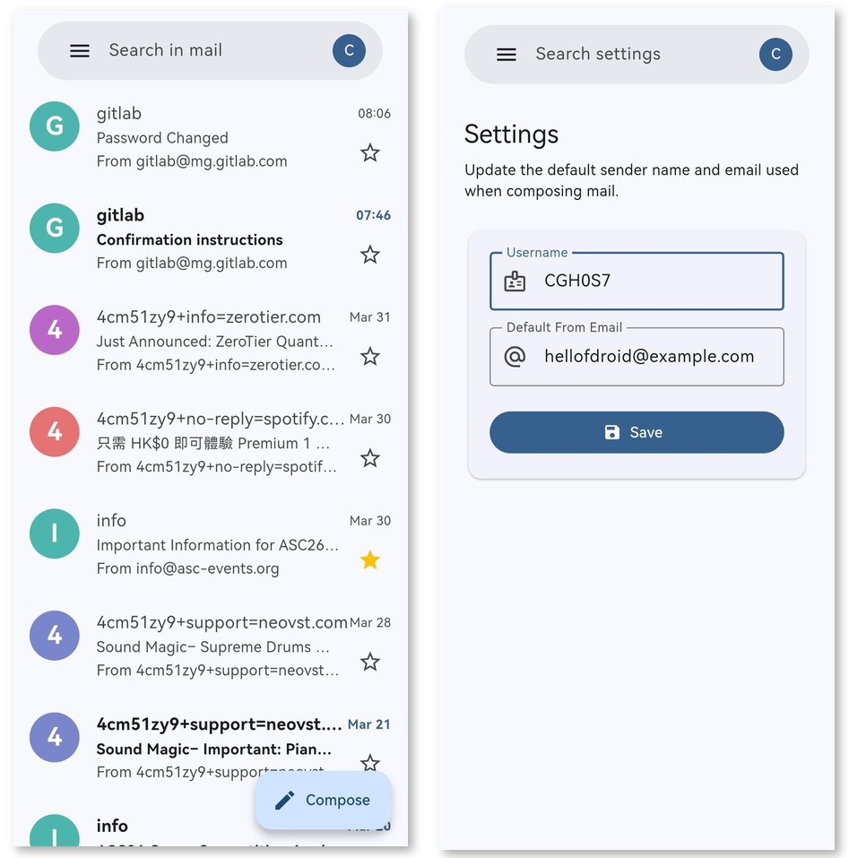

# Remail

A high-fidelity Gmail-inspired Flutter client for the [Resend.com](https://resend.com) email service.

Remail (formerly Rusend-Next) provides a modern, clean, and intuitive interface for managing your Resend emails, mirroring the familiar Gmail experience while leveraging the powerful Resend API.

<div align="center">

[](https://f-droid.org/zh_Hans/packages/ink.hifuu.rusend_next/)

**Download on F-Droid** — [ink.hifuu.rusend_next](https://f-droid.org/zh_Hans/packages/ink.hifuu.rusend_next/)

</div>

## Screenshots

<div align="center">
  
</div>

## Features

- **Inbox & Sent:** View your received and sent emails with ease.
- **Detailed Email View:** Rich HTML email rendering with support for interactive elements.
- **Compose:** Write and send emails with support for multiple recipients, subjects, HTML/Text content, and attachments.
- **Attachments:** Download and view email attachments directly from the app.
- **Search:** Quickly find emails using the integrated search functionality.
- **Responsive Design:** A polished UI that adapts to various screen sizes, featuring a navigation drawer and FAB.
- **Secure Authentication:** Simple and secure login using your Resend API Key.

## Technology Stack

- **Framework:** [Flutter](https://flutter.dev/)
- **State Management:** [Provider](https://pub.dev/packages/provider)
- **API Communication:** [http](https://pub.dev/packages/http)
- **Local Storage:** [shared_preferences](https://pub.dev/packages/shared_preferences)
- **Rich Content:** [flutter_widget_from_html](https://pub.dev/packages/flutter_widget_from_html)
- **File Handling:** [file_picker](https://pub.dev/packages/file_picker), [path_provider](https://pub.dev/packages/path_provider)

## Getting Started

### Prerequisites

- Flutter SDK (v3.11.1 or higher)
- A Resend.com account and API Key

### Installation

1.  **Clone the repository:**
    ```bash
    git clone https://github.com/CGH0S7/remail.git
    cd remail
    ```

2.  **Install dependencies:**
    ```bash
    flutter pub get
    ```

3.  **Run the application:**
    ```bash
    flutter run
    ```

### Configuration

Upon launching the app, you will be prompted to enter your **Resend API Key**. You can find your API Key in your Resend dashboard settings.

## Contributing

Contributions are welcome! Please feel free to submit a Pull Request.

## License

This project is licensed under the MIT License - see the [LICENSE](LICENSE) file for details.
